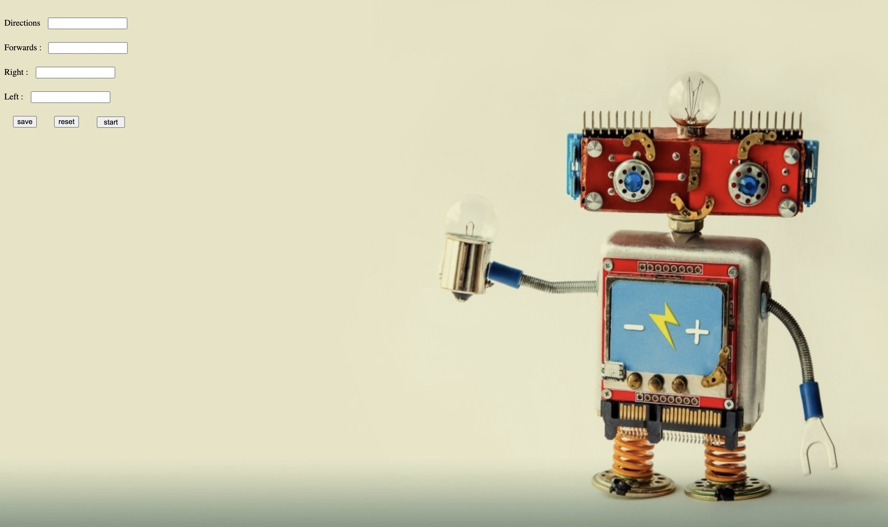
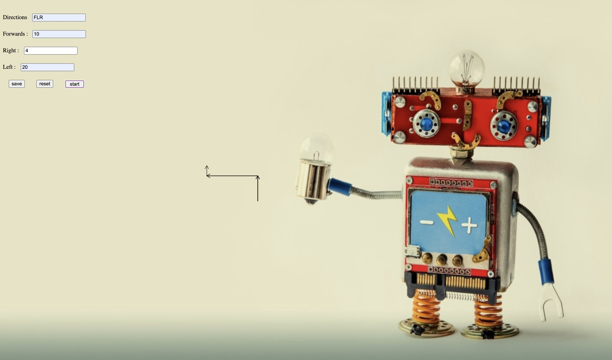
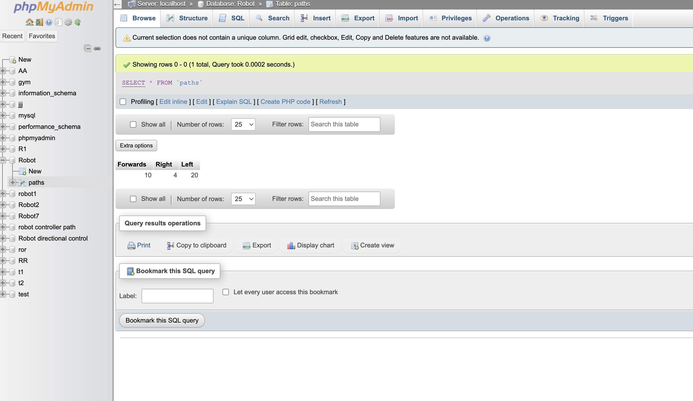
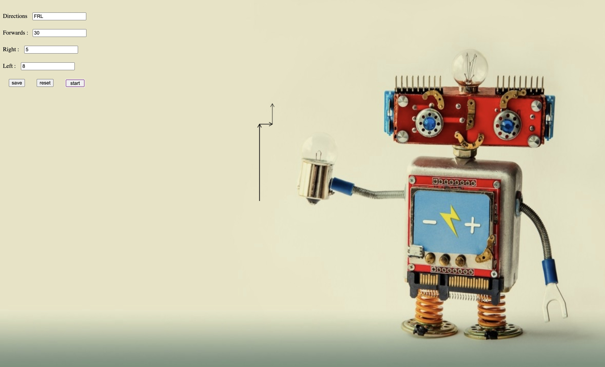
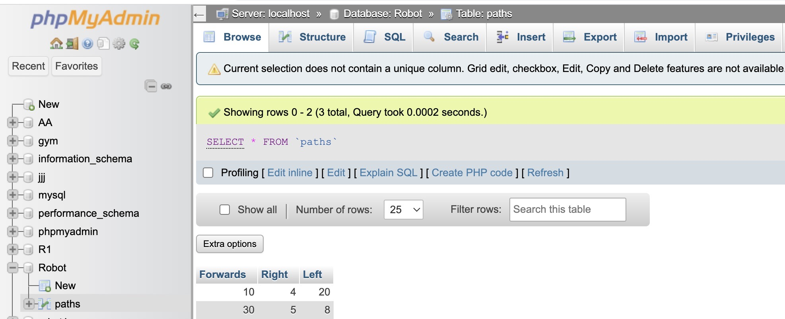

# paths_control
A web page to draw the robot movement path 
and store the path in the database

buttons
Save: To save the data in the database
Reset: To reset the entered data
start: start drawing the path
of direction is specified by entering the order of directions in the directions field, for example FLR

## web page
 

## Some pictures to draw the path and store in the database
 

 

 
